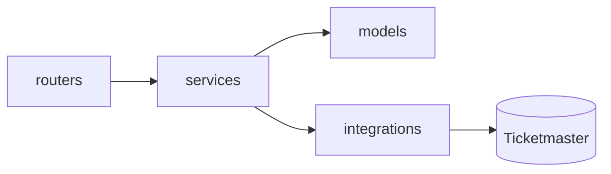
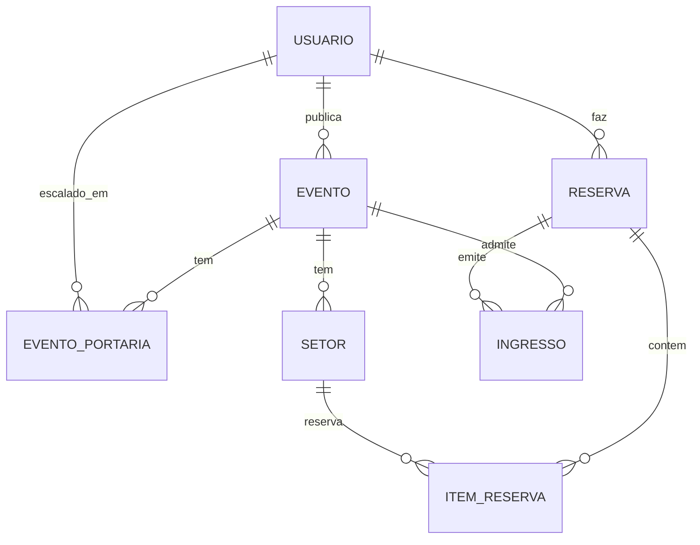
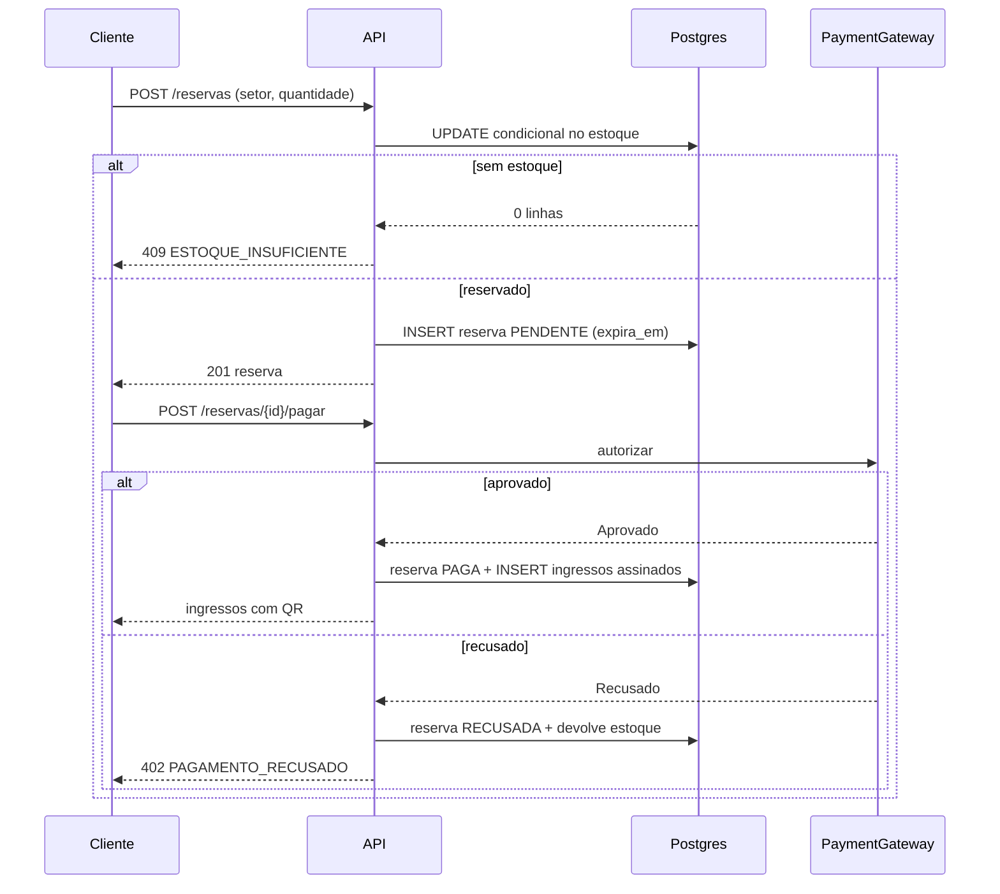
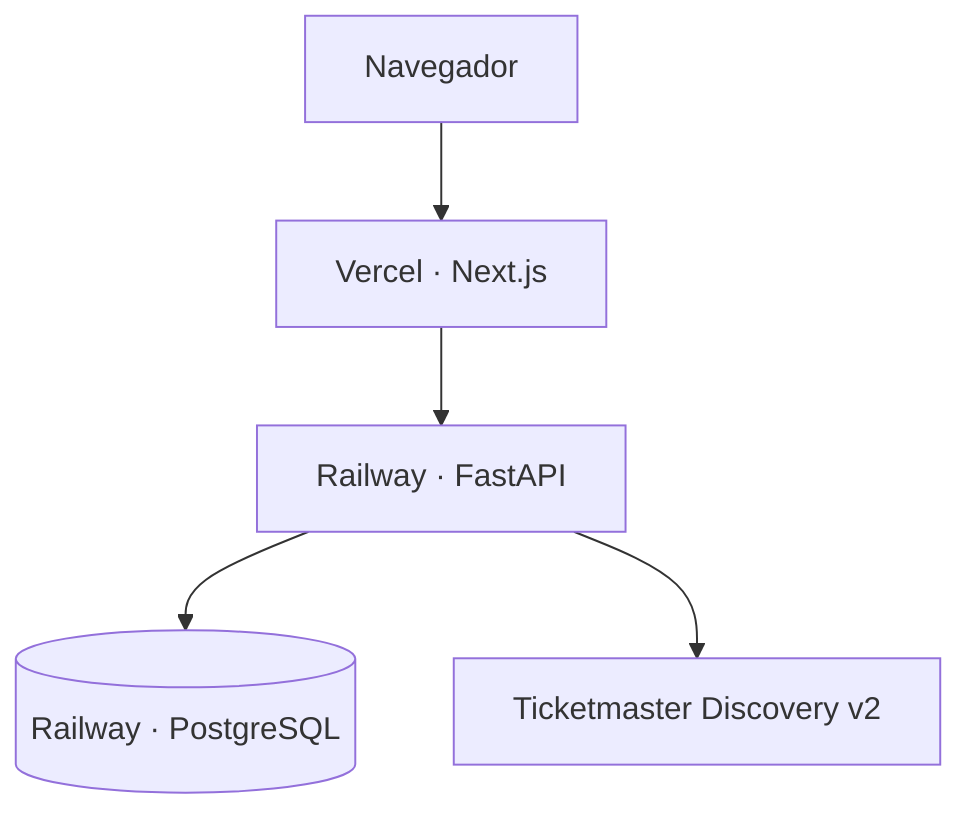

# Architecture Spine — elite-dev-RockHub

## Design Paradigm

**Camadas com serviços de domínio.** Duas camadas no backend, dependência sempre para dentro:

| Camada | Diretório | Responsabilidade |
|---|---|---|
| `routers` | `app/api/` | HTTP: validação de entrada, autenticação, códigos de status. Sem regra de negócio e sem consulta ao banco |
| `services` | `app/services/` | Regra de negócio, transações e acesso ao banco. Onde vivem as invariantes de estoque, pagamento e validação |

Regra de dependência: `routers → services → models`. Nunca o inverso, nunca pulando camada — um router jamais toca a sessão do SQLAlchemy diretamente.

Não existe camada de repositório: a `Session` do SQLAlchemy já cumpre esse papel, e interpor uma camada de repasse só adicionaria código sem separar nada de novo neste tamanho de projeto.



O frontend é Next.js com App Router; chama **apenas** a API própria, nunca serviço externo.

## Invariantes e Regras

### AD-1 — Catálogo externo é copiado no ato da publicação, não consultado ao vivo

- **Binds:** integração Ticketmaster, listagem de eventos, página de evento, ingresso
- **Prevents:** o fluxo de compra depender da disponibilidade e do limite de 5 req/s da API externa; nome, imagem ou local divergirem entre a listagem e o ingresso já emitido
- **Rule:** a Ticketmaster é chamada **somente** em endpoints do organizador (buscar atração no catálogo). Ao publicar, os campos usados são gravados no banco do evento. Nenhum endpoint de cliente ou de portaria chama a API externa.

### AD-2 — A chave da Ticketmaster nunca sai do backend

- **Binds:** integração externa, configuração, frontend
- **Prevents:** vazamento da credencial — ela trafega como query param, então qualquer chamada feita do navegador a expõe no histórico e no devtools
- **Rule:** `TICKETMASTER_API_KEY` só existe no ambiente do backend. O frontend não tem variável `NEXT_PUBLIC_` de credencial alguma.

### AD-3 — Estoque de setor muda por UPDATE condicional atômico

- **Binds:** reserva, cancelamento, expiração — toda escrita em estoque
- **Prevents:** venda do mesmo lugar duas vezes quando duas reservas chegam ao mesmo tempo
- **Rule:** nunca ler o estoque e depois gravar. Toda alteração é um único statement condicional dentro de transação:
  ```sql
  UPDATE setor SET vendidos = vendidos + :q
   WHERE id = :id AND vendidos + :q <= capacidade
  ```
  Zero linhas afetadas significa **sem estoque** e a transação é revertida. Além disso, a tabela carrega `CHECK (vendidos >= 0 AND vendidos <= capacidade)` como rede de segurança contra bug de aplicação.

### AD-4 — Reserva tem máquina de estados e segura estoque desde a criação

- **Binds:** checkout, pagamento, emissão de ingresso, expiração
- **Prevents:** estoque preso para sempre por checkout abandonado; e pagamento recusado deixando o lugar vendido
- **Rule:** estados `PENDENTE → PAGA | RECUSADA | EXPIRADA | CANCELADA`. A reserva nasce `PENDENTE` **já consumindo estoque** (AD-3) e carrega `expira_em = criação + 10 minutos`. Só `PAGA` emite ingressos. `RECUSADA`, `EXPIRADA` e `CANCELADA` devolvem o estoque, também por UPDATE condicional. Transição de estado é sempre condicionada ao estado anterior — jamais incondicional.

  **A expiração é preguiçosa, não agendada:** não há worker nem cron. Uma reserva vencida é colhida no momento em que alguém a toca — ao tentar pagá-la (`PENDENTE` com `expira_em` no passado vira `EXPIRADA` e o estoque volta antes de qualquer cobrança) ou ao alguém pedir estoque daquele setor (as vencidas são liberadas antes da tentativa de reserva). Consequência aceita: uma reserva vencida pode continuar contando no estoque até que alguém precise daquele setor — inofensivo, porque no instante em que o estoque importa ele já está correto.

### AD-5 — O código do ingresso é um token assinado, não um identificador

- **Binds:** emissão de ingresso, geração do QR, validação na portaria
- **Prevents:** forja do ingresso por adivinhação ou incremento de id
- **Rule:** o conteúdo do QR é `ID.ASSINATURA`, onde `ASSINATURA` é `HMAC-SHA256(TICKET_SIGNING_SECRET, ticket_id + evento_id + nonce)` em base64url. A portaria recalcula a assinatura; divergência é `INVÁLIDO` e nem chega a consultar o banco. O segredo vive só no ambiente do backend. Ids de ingresso são UUIDv4 — não sequenciais.

### AD-6 — Validação na portaria é um UPDATE condicional, nunca leitura seguida de escrita

- **Binds:** endpoint de validação
- **Prevents:** o mesmo ingresso ser aceito duas vezes quando dois leitores escaneiam no mesmo instante
- **Rule:**
  ```sql
  UPDATE ingresso SET usado_em = now(), validado_por = :portaria_id
   WHERE id = :id AND usado_em IS NULL
  ```
  Zero linhas afetadas com o ingresso existindo significa `JÁ_UTILIZADO`. O resultado da validação é derivado do número de linhas afetadas, não de um `SELECT` anterior.

### AD-7 — A portaria só valida evento em que foi escalada

- **Binds:** autorização da portaria, endpoint de validação, publicação de evento
- **Prevents:** qualquer conta com papel de portaria validar ingresso de qualquer evento do sistema — o papel diria *o que* a pessoa pode fazer, mas não *onde*
- **Rule:** existe vínculo `evento_portaria (evento_id, usuario_id)`, criado pelo organizador na publicação do evento. A validação sempre recebe o `evento_id` do contexto de trabalho escolhido. Ingresso válido cujo `evento_id` não bate com o contexto retorna `EVENTO_ERRADO`. Usuário de portaria sem vínculo com aquele evento recebe `403` antes de qualquer consulta ao ingresso. **Publicar um evento exige ao menos um usuário de portaria escalado** — isso impede evento publicado sem ninguém autorizado a validar.

### AD-8 — Compartilhamento usa token próprio, revogável, separado do código de validação

- **Binds:** compartilhar ingresso, visualização pública do ingresso
- **Prevents:** o mecanismo de compartilhar virar caminho de forja; e o dono perder a capacidade de cortar o acesso depois de enviado
- **Rule:** compartilhar gera `share_token` opaco e aleatório, guardado no ingresso e revogável pelo dono. A rota pública `/i/TOKEN` mostra o ingresso **com o QR**, sem exigir login — quem recebe o link consegue entrar no evento, como em Sympla e Eventim. O que impede abuso é a soma de uso único (AD-6) e revogação. O `share_token` **não** substitui a assinatura do AD-5 na validação — ele só dá acesso à visualização. Revogar apaga o token; o link antigo passa a retornar 404.

### AD-9 — Autorização por papel declarada no endpoint, papel único por conta

- **Binds:** todos os endpoints autenticados
- **Prevents:** verificação de papel espalhada e inconsistente dentro dos handlers
- **Rule:** autenticação por JWT com `sub` e `papel`. Cada conta tem exatamente um papel: `ORGANIZADOR`, `CLIENTE` ou `PORTARIA`. O papel exigido é declarado como dependência do FastAPI na assinatura do endpoint, nunca com `if` dentro do corpo.

### AD-10 — Pagamento é uma interface com implementação simulada

- **Binds:** checkout, transição de reserva
- **Prevents:** regra de pagamento espalhada pelo serviço de reserva, e impossibilidade de testar o caminho de recusa
- **Rule:** `PaymentGateway` é uma interface (`autorizar(reserva) -> Aprovado | Recusado`). A implementação `FakePaymentGateway` recusa quando **o número do cartão termina em `0002`** e aprova nos demais casos — mesma convenção dos cartões de teste da Stripe, determinística e documentada no README para o avaliador conseguir provocar a recusa de propósito. O serviço de reserva depende da interface, nunca da implementação.

### AD-11 — Dinheiro em centavos, tempo em UTC

- **Binds:** todo campo monetário e toda data do sistema
- **Prevents:** erro de arredondamento em ponto flutuante e divergência de fuso entre backend, banco e navegador
- **Rule:** valores monetários são inteiros em centavos (`BIGINT`), nunca `float`. Datas são `TIMESTAMPTZ` gravadas em UTC e trafegam em ISO-8601 com offset. A conversão para o fuso do usuário acontece só na renderização.

### AD-12 — Setores são definidos pelo organizador, não fixos no código

- **Binds:** publicação de evento, reserva, exibição de preço
- **Prevents:** "pista, VIP e camarote" virarem enum no código e travarem o produto
- **Rule:** um evento tem N setores, cada um com nome, capacidade e preço próprios. Preço e capacidade pertencem ao **setor**, nunca ao evento.

### AD-13 — `setor.vendidos` é a única fonte de verdade da disponibilidade

- **Binds:** listagem de eventos, página do evento, checkout, painel do organizador
- **Prevents:** duas partes do sistema calcularem disponibilidade de formas diferentes — uma lendo o contador, outra contando reservas ou ingressos — e mostrarem números que se contradizem
- **Rule:** disponibilidade é sempre `capacidade - vendidos`, lido do setor. É **proibido** derivar disponibilidade com `COUNT` de reservas ou de ingressos, em qualquer camada, inclusive em relatório e em tela do organizador.

### AD-14 — Ingresso só nasce dentro da transação que marca a reserva como PAGA

- **Binds:** pagamento, emissão de ingresso
- **Prevents:** dois donos para a criação do ingresso — pagamento e reserva emitindo cada um pelo seu lado — gerando ingresso órfão ou duplicado quando o pagamento é reprocessado
- **Rule:** o serviço de reserva é o **único** que cria ingresso, e o faz na mesma transação da transição `PENDENTE → PAGA` (AD-4). Nenhum outro serviço, rota ou tarefa emite ingresso. Reprocessar um pagamento já aprovado não gera ingresso novo, porque a transição de estado é condicionada ao estado anterior.

### AD-15 — Sessão por cookie `httpOnly`, senha com Argon2

- **Binds:** cadastro, login, toda rota autenticada, busca de dados no frontend
- **Prevents:** senha guardada de forma recuperável; token roubado por XSS; e duas formas diferentes de o frontend autenticar (uma lendo `localStorage`, outra lendo cookie), o que quebraria os Server Components
- **Rule:** senha é gravada como hash **Argon2id** (`argon2-cffi`), nunca em texto e nunca com hash reversível ou sem sal. O JWT viaja em cookie `httpOnly`, `Secure`, `SameSite=Lax`, com validade de **8 horas** — o suficiente para um turno de portaria. JavaScript nunca lê o token, e nenhum componente guarda credencial em `localStorage`. Sem refresh token: expirou, faz login de novo.

## Convenções de Consistência

| Assunto | Convenção |
|---|---|
| Nomes | Python e banco em `snake_case`; componentes React em `PascalCase`; domínio em português (`evento`, `setor`, `reserva`, `ingresso`) para bater com o enunciado |
| Identificadores | `UUIDv4` em tudo que aparece em URL ou QR. Chave sequencial só em tabela interna |
| Datas | `TIMESTAMPTZ` em UTC, ISO-8601 na API (AD-11) |
| Dinheiro | Inteiro em centavos, campo sufixado `_centavos` (AD-11) |
| Erro da API | Sempre `{"erro": {"codigo": "ESTOQUE_INSUFICIENTE", "mensagem": "..."}}`. O `codigo` é estável e o frontend decide o texto por ele, nunca pela mensagem |
| Resultado da validação | Enum fechado: `VALIDO`, `INVALIDO`, `JA_UTILIZADO`, `EVENTO_ERRADO` — os quatro exigidos pelo desafio |
| Transação | Aberta e fechada no `service`. `router` nunca abre transação nem faz commit |
| Migrações | Toda mudança de schema é migração Alembic versionada. Nunca `create_all` fora de teste |
| Configuração | Só por variável de ambiente, lidas por `Settings` do Pydantic. Segredo nenhum no repositório |
| Busca de dados no frontend | Server Component por padrão. `"use client"` só onde há interação que exige o navegador: câmera da portaria, seletor de quantidade, formulários. Evita duas formas de buscar a mesma coisa |

## Stack

Versões conferidas na web em 09/08/2026.

| Nome | Versão |
|---|---|
| Python | 3.12 |
| FastAPI | 0.141.1 |
| SQLAlchemy | 2.0.51 |
| Pydantic | 2.13.4 |
| Alembic | 1.19.1 |
| argon2-cffi | 25.1.0 |
| PostgreSQL | 16 |
| Node.js | 20.9+ (máquina de desenvolvimento: 24.14) |
| npm | 11.9 — gerenciador do frontend, `package-lock.json` versionado |
| Next.js | 16.3.0 |
| React | 19 |
| TypeScript | 5.1+ (mínimo exigido pelo Next 16) |
| qrcode.react | 4.2.0 |
| @yudiel/react-qr-scanner | 2.6.0 |

## Semente Estrutural

### Entidades



`USUARIO` carrega o papel (AD-9). `SETOR` carrega `capacidade`, `vendidos` e `preco_centavos` (AD-3, AD-12). `INGRESSO` carrega `usado_em`, `validado_por` e `share_token` (AD-6, AD-8).

### Fluxo de reserva



### Implantação



A chave da Ticketmaster existe apenas no ambiente da Railway (AD-2).

### Árvore

```text
backend/
  app/
    api/            # routers por papel: publico, cliente, organizador, portaria
    services/       # regra de negócio, transações e acesso ao banco
    models/         # SQLAlchemy
    schemas/        # Pydantic (entrada e saída)
    integrations/   # cliente Ticketmaster
    core/           # config, segurança, assinatura HMAC, dependências de papel
  migrations/       # Alembic
  seeds/            # dados de teste exigidos pelo desafio
  tests/
frontend/
  src/
    app/            # rotas do App Router
    components/
    lib/            # cliente da API
```

## Adiado

| O quê | Por quê |
|---|---|
| Mapa de assentos | Não é obrigatório; o desafio aceita venda por quantidade. Incremento depois do fluxo fechado |
| Tela de editar evento (adicionar/remover portaria depois da publicação) | Necessário em sistema real; cortado por prazo. **Deve constar no README** |
| Cancelamento pelo cliente com devolução ao estoque | Opcional no desafio. O modelo já suporta (AD-4), falta só o endpoint e a tela |
| Mapa de assentos em tempo real, WebSocket | Fora do escopo escolhido |
| Observabilidade, rate limiting próprio, cache distribuído | Volume de avaliação não justifica |
| Refresh token | JWT de 8 horas basta para o cenário avaliado (AD-15) |
| Camada de repositórios | A `Session` do SQLAlchemy já cumpre o papel; interpor repasse só adicionaria código neste tamanho de projeto |
| Worker de expiração de reservas | Substituído por expiração preguiçosa (AD-4), que não exige processo rodando |
| Teste automatizado de frontend | Não é exigido pelo desafio. As invariantes que valem ponto — estoque, assinatura do QR, validação idempotente — estão no backend, que tem `pytest`. **Deve constar no README** |
| Cadastro de organizador pela interface | Só cliente cria a própria conta (Story 1.5). Organizador e portaria vêm do seed, que é como o próprio enunciado os pede. **Adiado, não descartado:** entra depois que o fluxo obrigatório estiver de pé, se sobrar prazo — NFR6. Portaria continua fora em qualquer cenário, por causa do AD-7. **Deve constar no README** |
| Recuperação de senha, e-mail, nota fiscal, revenda | O enunciado dispensa explicitamente |

## A registrar no README

Compromissos assumidos que o avaliador precisa saber, conforme o desafio exige:

- Não há tela de editar evento; o vínculo com a portaria só é definido na publicação
- O pagamento é simulado: cartão terminando em `0002` recusa, qualquer outro aprova
- O link compartilhado expõe o QR e permite a entrada — decisão consciente, espelhando sistemas reais, com uso único e revogação como proteção
- Mapa de assentos não foi implementado; a venda é por quantidade em setores
